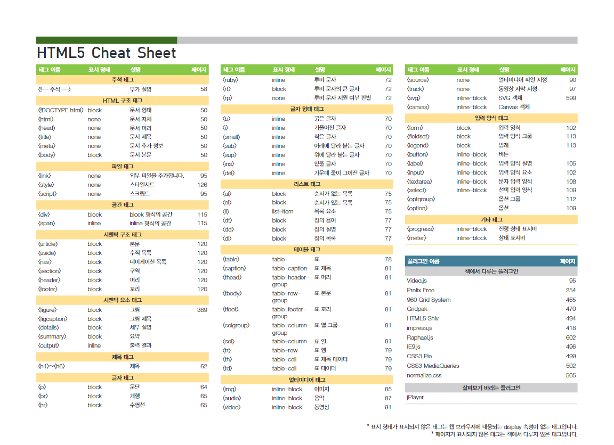
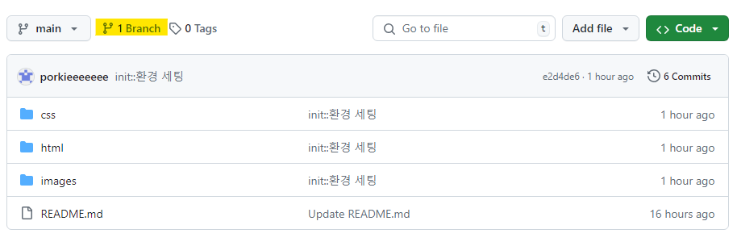
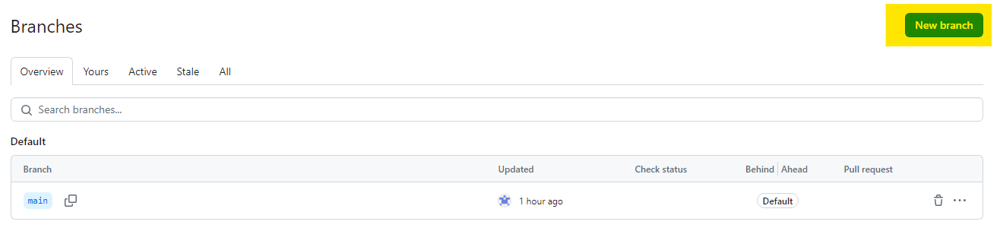
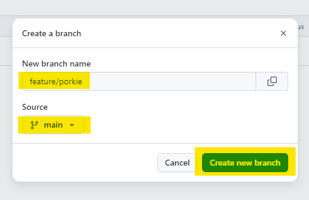
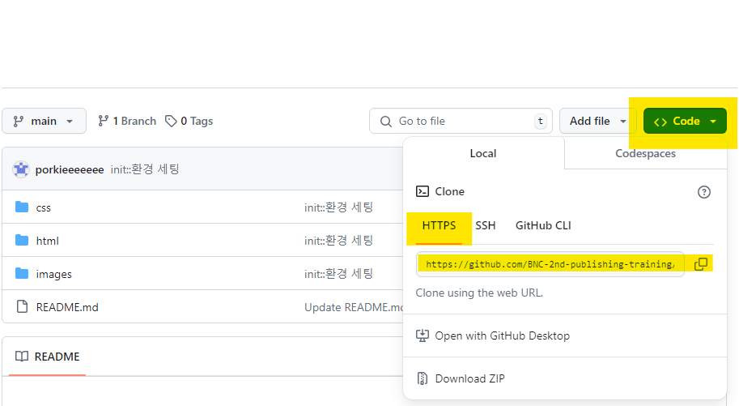

# 📚[1주차] HTML/CSS 이해
## 학습 목표

HTML 기본 구조 이해

  <ul>
    <li>
      <a href='https://poiemaweb.com/html5-syntax' target="_blank">HTML5 기본 문법</a>
    </li>
    <li>
      <a href='https://poiemaweb.com/html5-tag-basic' target="_blank">HTML5 구성 태그</a>
    </li>
  </ul>

HTML 기본 태그 학습

  <ul>
    <li>
      <a href='https://poiemaweb.com/html5-tag-text' target="_blank">텍스트 관련 태그</a>
    </li>
    <li>
      <a href='https://poiemaweb.com/html5-tag-link' target="_blank">하이퍼 링크 태그</a>
    </li>
    <li>
      <a href='https://poiemaweb.com/html5-tag-image-multimedia' target="_blank">멀티미디어 지원 태그</a>
    </li>
    <li>
      <a href='https://poiemaweb.com/html5-tag-forms' target="_blank">폼 태그</a>
    </li>
    <li>
      <a href='https://poiemaweb.com/html5-tag-structure' target="_blank">공간 분할 태그</a>
    </li>
  </ul>

HTML 치트시트 알기

  <ul>
    <li>
      <a href='https://www.geeksforgeeks.org/html-cheat-sheet/' target="_blank">HTML5 Cheat Sheet</a>
    </li>
    <li>
      
    </li>
  </ul>

CSS 기본 구조 학습

  <ul>
    <li>
      <a href='https://poiemaweb.com/css3-syntax' target="_blank">CSS 기본 문법</a>
    </li>
  </ul>

 
 

## 실습 내용
>💡 **HTML5 Cheat Sheet** 자료를 토대로 **HTML5 태그를 실습**해 봅시다. 💡 **HTML5 meta 태그**에 대해 자세히 알아보며 **실습**해 봅시다.
 
 

## 실습 가이드

### 1. 본인 브랜치 생성
  **1.1. 브랜치 버튼을 눌러 생성 페이지로 이동합니다.**
   
  

  **1.2. 우측 상단의 `New branch` 버튼을 눌러 새브랜치를 생성합니다.**
   
  

  **1.3. `feature/` + `본인 이름` 으로 브랜치 네임 설정 후 생성 완료합니다.**
   
  ※ 띄어쓰기가 필요할 경우 -(하이픈)을 사용합니다.
   
  ※ 브랜치 네임은 소문자로 작성합니다.
   
  

### 2. `main` 브랜치 클론
  **2.1. 우측 상단의 `<>Code` 버튼을 눌러 main 브랜치에서 기본 코드를 클론 받습니다.**
  

### 3. `index.html` 파일에 실습 내용 추가하여 git push
코드 작성이 완료 되었을 경우, 본인 브랜치에 commit 후 push 합니다.
 
 
